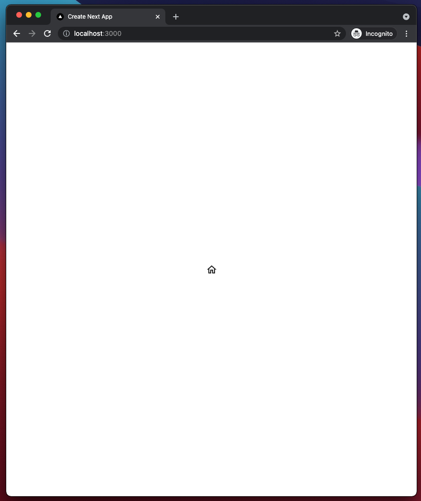
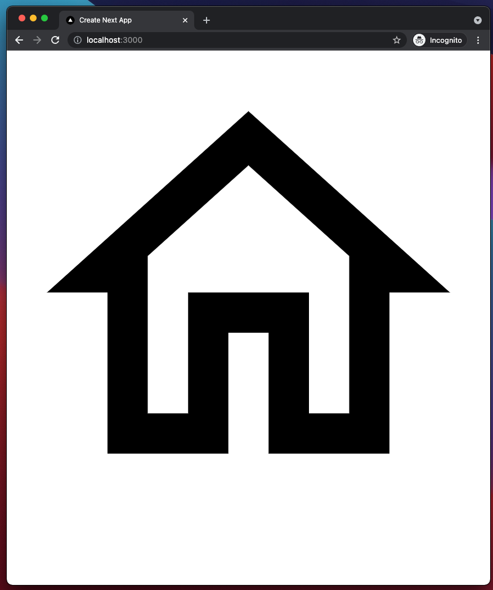

# Summary

Shows a problem when combining:
- Material UI V5
- mui styled-components engine
- Nextjs SSR
- yarn berry (a.k.a. yarn modern or yarn 2/3) workspaces


### Reproduce
1. Check out repo
2. run `yarn`
3. run `yarn dev`
4. visit http://localhost:3000/

You will get a page with a properly sized material ui icon in the center:


5. run `yarn build`
6. run `yarn start`
7. visit http://localhost:3000/ again

Now the icon does not have any styles attached to it and takes on the full screen width.



### Fix
1. Remove the `styled-components` dependency from the root `package.json`:
```diff
    "start": "yarn workspace @mui5-sc-workspaces-issue/next start"
  },
  "resolutions": {
    "@mui/styled-engine": "npm:@mui/styled-engine-sc@5.0.4"
  },
  "dependencies": {
-    "styled-components": "^5.3.1"
  },
  "devDependencies": {
    "@types/node": "^16.11.6",
```
2. Repeat the steps above. This time, the icon styles get applied on the prod build as well.
